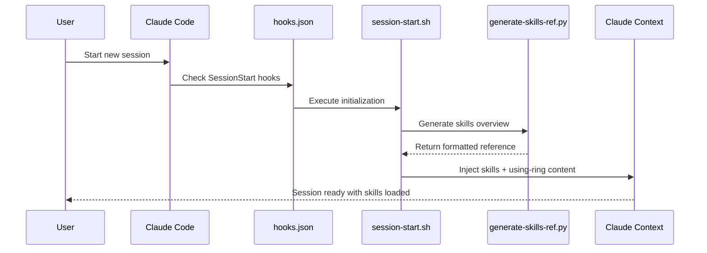
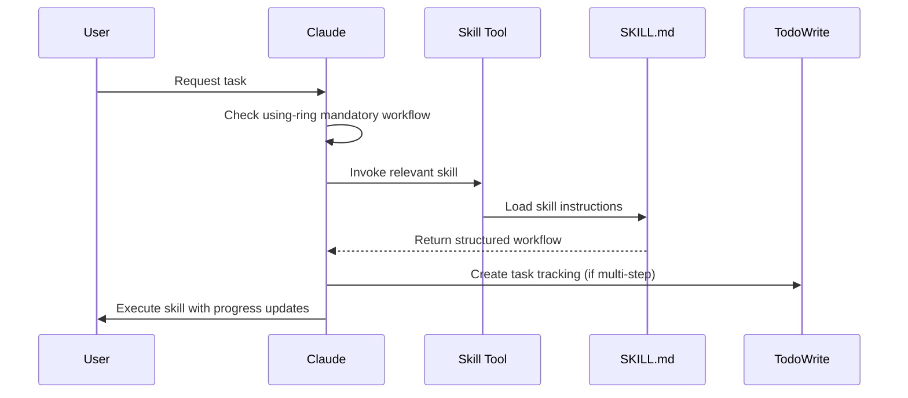
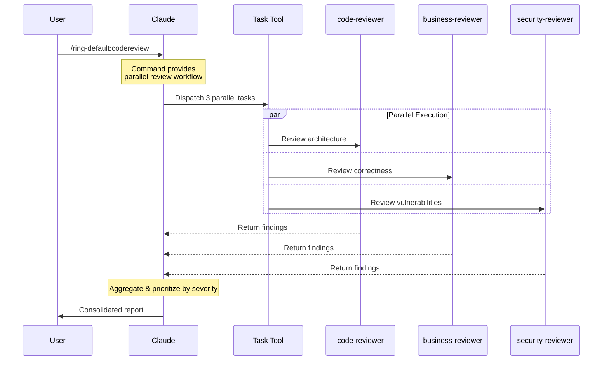

# Ring Architecture Documentation

## Table of Contents

1. [Overview](#overview)
2. [Marketplace Structure](#marketplace-structure)
3. [Component Hierarchy](#component-hierarchy)
4. [Core Components](#core-components)
5. [Data & Control Flow](#data--control-flow)
6. [Integration with Claude Code](#integration-with-claude-code)
7. [Execution Patterns](#execution-patterns)
8. [Component Relationships](#component-relationships)

## Overview

Ring is a **Claude Code plugin marketplace** that provides a comprehensive skills library and workflow system with **5 active plugins**. It extends Claude Code's capabilities through structured, reusable patterns that enforce proven software engineering practices.

### Architecture Philosophy

Ring operates on three core principles:

1. **Mandatory Workflows** - Critical skills (like using-ring) enforce specific behaviors
2. **Parallel Execution** - Review systems run concurrently for speed
3. **Session Context** - Skills load automatically at session start
4. **Modular Plugins** - Specialized plugins for different domains and teams

### System Boundaries

```
┌─────────────────────────────────────────────────────────────────────────────────┐
│                              Claude Code                                         │
│  ┌───────────────────────────────────────────────────────────────────────────┐  │
│  │                          Ring Marketplace                                  │  │
│  │  ┌──────────────────────┐  ┌──────────────────────┐                       │  │
│  │  │ ring-default         │  │ ring-dev-team        │                       │  │
│  │  │ Skills(21) Agents(5) │  │ Skills(10) Agents(7) │                       │  │
│  │  │ Cmds(7) Hooks/Lib    │  │ Cmds(5)              │                       │  │
│  │  └──────────────────────┘  └──────────────────────┘                       │  │
│  │  ┌──────────────────────┐  ┌──────────────────────┐                       │  │
│  │  │ ring-finops-team     │  │ ring-pm-team         │                       │  │
│  │  │ Skills(6) Agents(2)  │  │ Skills(10) Cmds(2)   │                       │  │
│  │  └──────────────────────┘  └──────────────────────┘                       │  │
│  │  ┌──────────────────────┐                                                 │  │
│  │  │ ring-tw-team         │                                                 │  │
│  │  │ Skills(7) Agents(3)  │                                                 │  │
│  │  │ Cmds(3)              │                                                 │  │
│  │  └──────────────────────┘                                                 │  │
│  └───────────────────────────────────────────────────────────────────────────┘  │
│                                                                                  │
│  Native Tools: Skill, Task, TodoWrite, SlashCommand                             │
└─────────────────────────────────────────────────────────────────────────────────┘
```

## Marketplace Structure

Ring is organized as a monorepo marketplace with multiple plugin collections:

```
ring/                                  # Monorepo root
├── .claude-plugin/
│   └── marketplace.json              # Multi-plugin registry (5 active plugins)
├── default/                          # Core plugin: ring-default
├── dev-team/                         # Developer agents: ring-dev-team
├── finops-team/                      # FinOps & regulatory: ring-finops-team
├── pm-team/                          # Product planning: ring-pm-team
└── tw-team/                          # Technical writing: ring-tw-team
```

### Active Plugins

*Versions managed in `.claude-plugin/marketplace.json`*

| Plugin | Description | Components |
|--------|-------------|------------|
| **ring-default** | Core skills library | 21 skills, 5 agents, 7 commands |
| **ring-dev-team** | Developer agents | 10 skills, 7 agents, 5 commands |
| **ring-finops-team** | FinOps & regulatory compliance | 6 skills, 2 agents |
| **ring-pm-team** | Product planning workflows | 10 skills, 3 agents, 2 commands |
| **ring-tw-team** | Technical writing specialists | 7 skills, 3 agents, 3 commands |

## Component Hierarchy

### 1. Skills (`skills/`)
**Purpose:** Core instruction sets that define workflows and best practices

**Structure:**
```
skills/
├── {skill-name}/
│   └── SKILL.md           # Skill definition with frontmatter
├── shared-patterns/       # Reusable patterns across skills
│   ├── state-tracking.md
│   ├── failure-recovery.md
│   ├── exit-criteria.md
│   └── todowrite-integration.md
```

**Key Characteristics:**
- Self-contained directories with `SKILL.md` files
- YAML frontmatter: `name`, `description`, `when_to_use`
- Invoked via Claude's `Skill` tool
- Can reference shared patterns for common behaviors

### 2. Agents (`agents/`)
**Purpose:** Specialized agents that analyze code/designs or provide domain expertise using AI models

**Structure (ring-default plugin):**
```
default/agents/
├── code-reviewer.md           # Foundation review (architecture, patterns)
├── business-logic-reviewer.md # Correctness review (requirements, edge cases)
├── security-reviewer.md       # Safety review (OWASP, auth, validation)
├── write-plan.md              # Implementation planning
└── codebase-explorer.md       # Deep architecture analysis (Opus)
```

**Structure (ring-dev-team plugin):**
```
dev-team/agents/
├── backend-engineer-golang.md     # Go backend specialist for financial systems
├── backend-engineer-typescript.md # TypeScript/Node.js backend specialist
├── devops-engineer.md             # DevOps infrastructure specialist
├── frontend-bff-engineer-typescript.md # BFF & React/Next.js frontend specialist
├── frontend-designer.md           # Visual design specialist
├── qa-analyst.md                  # Quality assurance specialist
└── sre.md                         # Site reliability engineer
```

**Key Characteristics:**
- Invoked via Claude's `Task` tool with `subagent_type`
- Must specify model (typically "opus" for comprehensive analysis)
- Review agents run in parallel (3 reviewers dispatch simultaneously via `/ring-default:codereview` command)
- Developer agents provide specialized domain expertise
- Return structured reports with severity-based findings

**Note:** Parallel review orchestration is handled by the `/ring-default:codereview` command

**Standards Compliance Output (ring-dev-team agents):**

All ring-dev-team agents include a `## Standards Compliance` section in their output schema:

```yaml
- name: "Standards Compliance"
  pattern: "^## Standards Compliance"
  required: false  # In schema, but MANDATORY when invoked from dev-refactor
  description: "MANDATORY when invoked from dev-refactor skill"
```

**Conditional Requirement: `invoked_from_dev_refactor`**

| Invocation Context | Standards Compliance | Detection Mechanism |
|--------------------|---------------------|---------------------|
| Direct agent call | Optional | N/A |
| Via `dev-cycle` skill | Optional | N/A |
| Via `dev-refactor` skill | **MANDATORY** | Prompt contains `**MODE: ANALYSIS ONLY**` |

**How Enforcement Works:**

```
┌─────────────────────────────────────────────────────────────────────┐
│  User invokes: /ring-dev-team:dev-refactor                          │
│         ↓                                                           │
│  dev-refactor skill dispatches agents with prompt:                  │
│  "**MODE: ANALYSIS ONLY** - Compare codebase with Ring standards"   │
│         ↓                                                           │
│  Agent detects "**MODE: ANALYSIS ONLY**" in prompt                  │
│         ↓                                                           │
│  Agent loads Ring standards via WebFetch                            │
│         ↓                                                           │
│  Agent produces Standards Compliance output (MANDATORY)             │
└─────────────────────────────────────────────────────────────────────┘
```

**Affected Agents:**
- `ring-dev-team:backend-engineer-golang` → loads `golang.md`
- `ring-dev-team:backend-engineer-typescript` → loads `typescript.md`
- `ring-dev-team:devops-engineer` → loads `devops.md`
- `ring-dev-team:frontend-bff-engineer-typescript` → loads `frontend.md`
- `ring-dev-team:frontend-designer` → loads `frontend.md`
- `ring-dev-team:qa-analyst` → loads `qa.md`
- `ring-dev-team:sre` → loads `sre.md`

**Output Format (when non-compliant):**
```markdown
## Standards Compliance

### Lerian/Ring Standards Comparison
| Category | Current Pattern | Expected Pattern | Status | File/Location |
|----------|----------------|------------------|--------|---------------|
| Logging | fmt.Println | lib-commons/zap | ⚠️ Non-Compliant | service/*.go |

### Compliance Summary
- Total Violations: N
- Critical: N, High: N, Medium: N, Low: N

### Required Changes for Compliance
1. **Category Migration**
   - Replace: `current pattern`
   - With: `expected pattern`
   - Files affected: [list]
```

**Cross-References:**
- CLAUDE.md: Standards Compliance (Conditional Output Section)
- `dev-team/skills/dev-refactor/SKILL.md`: HARD GATES defining requirement
- `dev-team/hooks/session-start.sh`: Injects guidance at session start

### 3. Commands (`commands/`)
**Purpose:** Slash commands that provide shortcuts to skills/workflows

**Structure:**
```
default/commands/
├── brainstorm.md       # /ring-default:brainstorm - Socratic design refinement
├── write-plan.md       # /ring-default:write-plan - Implementation planning
├── execute-plan.md     # /ring-default:execute-plan - Batch execution
├── codereview.md       # /ring-default:codereview - Parallel 3-reviewer dispatch
└── worktree.md         # /ring-default:worktree - Git worktree creation

pm-team/commands/
├── pre-dev-feature.md  # /ring-pm-team:pre-dev-feature - 3-gate workflow
└── pre-dev-full.md     # /ring-pm-team:pre-dev-full - 8-gate workflow
```

**Key Characteristics:**
- Simple `.md` files with YAML frontmatter
- Invoked via `/ring-{plugin}:{command}` syntax
- Typically reference a corresponding skill
- Expand into full skill/agent invocation

### 4. Hooks (`hooks/`)
**Purpose:** Session lifecycle management and automatic initialization

**Structure:**
```
default/hooks/
├── hooks.json              # Hook configuration (SessionStart, UserPromptSubmit)
├── session-start.sh        # Main initialization script
├── generate-skills-ref.py  # Dynamic skill reference generator
└── claude-md-reminder.sh   # CLAUDE.md reminder on prompt submit
```

**Key Characteristics:**
- Triggers on SessionStart events (startup|resume, clear|compact)
- Triggers on UserPromptSubmit for reminders
- Injects skills context into Claude's memory
- Auto-generates skills quick reference from frontmatter
- Ensures mandatory workflows are loaded

### 5. Plugin Configuration (`.claude-plugin/`)
**Purpose:** Integration metadata for Claude Code marketplace

**Structure:**
```
.claude-plugin/
└── marketplace.json    # Multi-plugin registry
    ├── ring-default     # Core skills library
    ├── ring-dev-team    # Developer agents
    ├── ring-pm-team     # Product planning
    ├── ring-finops-team # FinOps & regulatory
    └── ring-tw-team     # Technical writing
```

**marketplace.json Schema:**
```json
{
  "name": "ring",
  "description": "...",
  "owner": { "name": "...", "email": "..." },
  "plugins": [
    {
      "name": "ring-default",
      "version": "...",
      "source": "./default",
      "keywords": ["skills", "tdd", "debugging", ...]
    },
    {
      "name": "ring-dev-team",
      "version": "...",
      "source": "./dev-team",
      "keywords": ["developer", "agents"]
    },
    {
      "name": "ring-pm-team",
      "version": "...",
      "source": "./pm-team",
      "keywords": ["product", "planning"]
    },
    {
      "name": "ring-finops-team",
      "version": "...",
      "source": "./finops-team",
      "keywords": ["finops", "regulatory"]
    },
    {
      "name": "ring-tw-team",
      "version": "...",
      "source": "./tw-team",
      "keywords": ["technical-writing", "documentation"]
    }
  ]
}
```

## Data & Control Flow

### Session Initialization Flow



### Skill Invocation Flow



### Parallel Review Flow



## Integration with Claude Code

### Native Tool Integration

Ring leverages four primary Claude Code tools:

1. **Skill Tool**
   - Invokes skills by name: `skill: "ring-default:test-driven-development"`
   - Skills expand into full instructions within conversation
   - Skill content becomes part of Claude's working context

2. **Task Tool**
   - Dispatches agents to subagent instances: `Task(subagent_type="ring-default:code-reviewer", model="opus")`
   - Enables parallel execution (multiple Tasks in one message)
   - Returns structured reports from independent analysis

3. **TodoWrite Tool**
   - Tracks multi-step workflows: `TodoWrite(todos=[...])`
   - Integrates with skills via shared patterns
   - Provides progress visibility to users

4. **SlashCommand Tool**
   - Executes commands: `SlashCommand(command="/ring-default:brainstorm")`
   - Commands expand to skill/agent invocations
   - Provides user-friendly shortcuts

### Session Context Injection

At session start, Ring injects two critical pieces of context:

1. **Skills Quick Reference** - Auto-generated overview of all available skills
2. **using-ring Skill** - Mandatory workflow that enforces skill checking

This context becomes part of Claude's memory for the entire session, ensuring:
- Claude knows which skills are available
- Mandatory workflows are enforced
- Skills are checked before any task

## Execution Patterns

### Pattern 1: Mandatory Skill Checking

```
User Request → using-ring check → Relevant skill?
    ├─ Yes → Invoke skill → Follow workflow
    └─ No → Proceed with task
```

**Implementation:** The using-ring skill is loaded at session start and contains strict instructions to check for relevant skills before ANY task.

### Pattern 2: Parallel Review Execution

```
Review Request → /ring-default:codereview → Dispatch 3 Tasks (parallel)
    ├─ ring-default:code-reviewer           ─┐
    ├─ ring-default:business-logic-reviewer ─┼─→ Aggregate findings → Handle by severity
    └─ ring-default:security-reviewer       ─┘
```

**Implementation:** Single message with 3 Task tool calls ensures parallel execution. All reviewers work independently and return simultaneously.

### Pattern 3: Skill-to-Command Mapping

```
User: /ring-default:brainstorm
    ↓
SlashCommand Tool
    ↓
commands/brainstorm.md
    ↓
"Use and follow the brainstorming skill"
    ↓
Skill Tool: ring-default:brainstorming
    ↓
skills/brainstorming/SKILL.md
```

**Implementation:** Commands are thin wrappers that immediately invoke corresponding skills.

### Pattern 4: Progressive Skill Execution

```
Complex Skill → TodoWrite tracking
    ├─ Phase 1: Understanding     [in_progress]
    ├─ Phase 2: Exploration       [pending]
    ├─ Phase 3: Design           [pending]
    └─ Phase 4: Documentation    [pending]
```

**Implementation:** Multi-phase skills use TodoWrite to track progress through structured workflows.

## Component Relationships

### Skills ↔ Agents

**Difference:**
- **Skills:** Instructions executed by current Claude instance
- **Agents:** Specialized reviewers executed by separate Claude instances

**Interaction:**
- Skills can invoke agents (e.g., requesting-code-review skill dispatches review agents)
- Agents don't typically invoke skills (they're independent analyzers)

### Skills ↔ Commands

**Relationship:** One-to-one or one-to-many mapping
- Most commands map directly to a single skill
- Some commands (like review) orchestrate multiple components

**Example Mappings:**
- `/ring-default:brainstorm` → `brainstorming` skill
- `/ring-default:write-plan` → `writing-plans` skill
- `/ring-default:codereview` → dispatches 3 parallel review agents (`ring-default:code-reviewer`, `ring-default:business-logic-reviewer`, `ring-default:security-reviewer`)

### Skills ↔ Shared Patterns

**Relationship:** Inheritance/composition
- Skills reference shared patterns for common behaviors
- Patterns provide reusable workflows (state tracking, failure recovery)

**Example:**
```markdown
# In a skill:
See `skills/shared-patterns/todowrite-integration.md` for tracking setup
```

### Hooks ↔ Skills

**Relationship:** Initialization and context loading
- Hooks load skill metadata at session start
- generate-skills-ref.py scans all SKILL.md frontmatter
- session-start.sh injects using-ring skill content

**Data Flow:**
```
SKILL.md frontmatter → generate-skills-ref.py → formatted overview → session context
```

### Agents ↔ Models

**Relationship:** Model requirement specification
- Agents specify required AI model in frontmatter
- Review agents typically require "opus" for comprehensive analysis
- Model choice affects depth and quality of analysis

### TodoWrite ↔ Skills

**Relationship:** Progress tracking integration
- Multi-step skills create TodoWrite items
- Each phase updates todo status (pending → in_progress → completed)
- Provides user visibility into workflow progress

## Key Architectural Decisions

### 1. Parallel vs Sequential Reviews
**Decision:** Reviews run in parallel, not sequentially
**Rationale:** 3x faster feedback, comprehensive coverage, easier prioritization
**Implementation:** Single message with multiple Task calls

### 2. Session Context Injection
**Decision:** Load all skills metadata at session start
**Rationale:** Ensures Claude always knows available capabilities
**Trade-off:** Larger initial context vs. consistent skill awareness

### 3. Mandatory Workflows
**Decision:** Some skills (using-ring) are non-negotiable
**Rationale:** Prevents common failures, enforces best practices
**Enforcement:** Loaded automatically, contains strict instructions

### 4. Skill vs Agent Separation
**Decision:** Skills for workflows, agents for analysis
**Rationale:** Different execution models (local vs. subagent)
**Benefit:** Clear separation of concerns

### 5. Frontmatter-Driven Discovery
**Decision:** All metadata in YAML frontmatter
**Rationale:** Single source of truth, easy parsing, consistent structure
**Usage:** Auto-generation of documentation, skill matching

## Extension Points

### Adding New Skills
1. Create `skills/{name}/SKILL.md` with frontmatter
2. Skills auto-discovered by generate-skills-ref.py
3. Available immediately after session restart

### Adding New Agents
1. Create `{plugin}/agents/{name}.md` with model specification
2. Include YAML frontmatter: `name`, `description`, `model`, `version`
3. Invoke via Task tool with `subagent_type="ring-{plugin}:{name}"`
4. Review agents can run in parallel via `/ring-default:codereview`
5. Developer agents provide domain expertise via direct Task invocation

### Adding New Commands
1. Create `commands/{name}.md`
2. Reference skill or agent to invoke
3. Available via `/ring-{plugin}:{name}`

### Adding Shared Patterns
1. Create `skills/shared-patterns/{pattern}.md`
2. Reference from skills that need the pattern
3. Maintains consistency across skills

### Adding New Plugins
1. Create plugin directory: `mkdir -p {plugin-name}/{skills,agents,commands,hooks,lib}`
2. Register in `.claude-plugin/marketplace.json`:
   ```json
   {
     "name": "ring-{plugin-name}",
     "version": "0.1.0",
     "source": "./{plugin-name}",
     "keywords": [...]
   }
   ```
   (Note: Initial version is 0.1.0, then managed via version bumps)
3. Create `{plugin-name}/hooks/hooks.json` for initialization
4. Add skills/agents following same structure as `default/`

## Performance Considerations

### Parallel Execution Benefits
- **3x faster reviews** - All reviewers run simultaneously
- **No blocking** - Independent agents don't wait for each other
- **Better resource utilization** - Multiple Claude instances work concurrently

### Context Management
- **Session start overhead** - One-time loading of skills context
- **Skill invocation** - Skills expand inline, no additional calls
- **Agent invocation** - Separate instances, clean context per agent

### Optimization Strategies
1. **Selective agent usage** - Only invoke relevant reviewers
2. **Skill caching** - Skills loaded once per session
3. **Parallel by default** - Never chain reviewers sequentially
4. **Early validation** - Preflight checks prevent wasted work

## Common Patterns and Anti-Patterns

### Patterns to Follow
✅ Check for relevant skills before any task
✅ Run reviewers in parallel for speed
✅ Use TodoWrite for multi-step workflows
✅ Reference shared patterns for consistency
✅ Specify models explicitly for agents

### Anti-Patterns to Avoid
❌ Skipping skill checks (violates using-ring)
❌ Running reviewers sequentially (3x slower)
❌ Implementing without tests (violates TDD)
❌ Claiming completion without verification
❌ Hardcoding workflows instead of using skills

## Troubleshooting Guide

### Skills Not Loading
1. Check hooks/hooks.json configuration
2. Verify session-start.sh is executable
3. Ensure SKILL.md has valid frontmatter

### Parallel Reviews Not Working
1. Ensure all Task calls in single message
2. Verify model specification (opus required)
3. Check agent names match exactly

### Commands Not Recognized
1. Verify command file exists in commands/
2. Check command name matches file name
3. Ensure proper frontmatter in command file

### Context Overflow
1. Consider selective skill loading
2. Use focused agent invocations
3. Clear completed todos regularly

## Summary

Ring's architecture is designed for:
- **Modularity** - Independent, composable components across multiple plugins
- **Performance** - Parallel execution wherever possible (3x faster reviews)
- **Reliability** - Mandatory workflows prevent failures
- **Extensibility** - Easy to add new skills/agents/commands/plugins
- **Scalability** - Marketplace structure supports product and team-specific plugins
- **Integration** - Seamless with Claude Code's native tools

### Current State

*Component counts reflect current state; plugin versions managed in `.claude-plugin/marketplace.json`*

| Component | Count | Location |
|-----------|-------|----------|
| Active Plugins | 5 | `default/`, `dev-team/`, `finops-team/`, `pm-team/`, `tw-team/` |
| Skills (ring-default) | 21 | `default/skills/` |
| Skills (ring-dev-team) | 10 | `dev-team/skills/` |
| Skills (ring-finops-team) | 6 | `finops-team/skills/` |
| Skills (ring-pm-team) | 10 | `pm-team/skills/` |
| Skills (ring-tw-team) | 7 | `tw-team/skills/` |
| **Total Skills** | **54** | **All plugins** |
| Agents (ring-default) | 5 | `default/agents/` |
| Agents (ring-dev-team) | 7 | `dev-team/agents/` |
| Agents (ring-pm-team) | 3 | `pm-team/agents/` |
| Agents (ring-finops-team) | 2 | `finops-team/agents/` |
| Agents (ring-tw-team) | 3 | `tw-team/agents/` |
| **Total Agents** | **20** | **All plugins** |
| Commands (ring-default) | 7 | `default/commands/` |
| Commands (ring-dev-team) | 5 | `dev-team/commands/` |
| Commands (ring-pm-team) | 2 | `pm-team/commands/` |
| Commands (ring-tw-team) | 3 | `tw-team/commands/` |
| **Total Commands** | **17** | **All plugins** |
| Hooks | Per plugin | `{plugin}/hooks/` |
| Lib utilities | 9 | `default/lib/` |

The system achieves these goals through clear component separation, structured workflows, automatic context management, and a modular marketplace architecture, creating a robust foundation for AI-assisted software development.