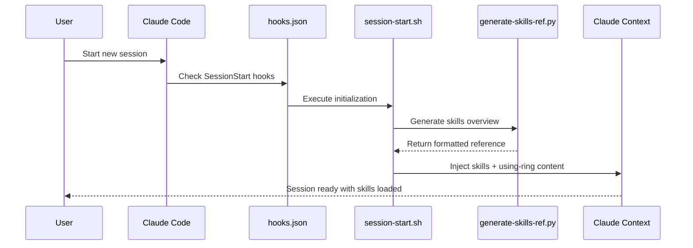
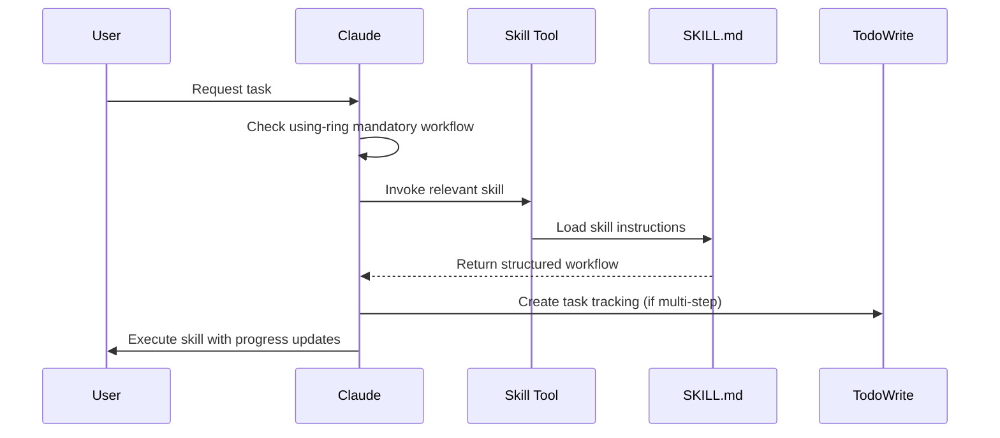
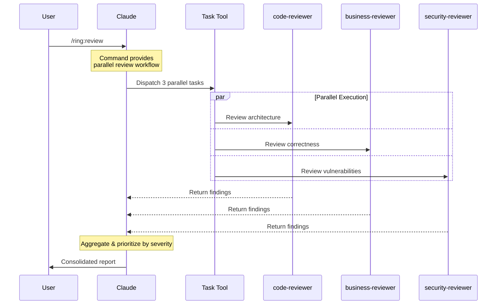

# Ring Architecture Documentation

## Table of Contents

1. [Overview](#overview)
2. [Component Hierarchy](#component-hierarchy)
3. [Core Components](#core-components)
4. [Data & Control Flow](#data--control-flow)
5. [Integration with Claude Code](#integration-with-claude-code)
6. [Execution Patterns](#execution-patterns)
7. [Component Relationships](#component-relationships)

## Overview

Ring is a Claude Code plugin that provides a comprehensive skills library and workflow system. It extends Claude Code's capabilities through structured, reusable patterns that enforce proven software engineering practices.

### Architecture Philosophy

Ring operates on three core principles:

1. **Mandatory Workflows** - Critical skills (like using-ring) enforce specific behaviors
2. **Parallel Execution** - Review systems run concurrently for speed
3. **Session Context** - Skills load automatically at session start

### System Boundaries

```
┌─────────────────────────────────────────────────────────┐
│                     Claude Code                         │
│  ┌───────────────────────────────────────────────────┐  │
│  │                  Ring Plugin                      │  │
│  │  ┌─────────────┐  ┌─────────────┐  ┌──────────┐ │  │
│  │  │   Skills    │  │   Agents    │  │ Commands │ │  │
│  │  └─────────────┘  └─────────────┘  └──────────┘ │  │
│  │  ┌─────────────┐  ┌─────────────┐               │  │
│  │  │    Hooks    │  │     Lib     │               │  │
│  │  └─────────────┘  └─────────────┘               │  │
│  └───────────────────────────────────────────────────┘  │
│                                                          │
│  Native Tools: Skill, Task, TodoWrite, SlashCommand     │
└─────────────────────────────────────────────────────────┘
```

## Component Hierarchy

### 1. Skills (`skills/`)
**Purpose:** Core instruction sets that define workflows and best practices

**Structure:**
```
skills/
├── {skill-name}/
│   └── SKILL.md           # Skill definition with frontmatter
├── shared-patterns/       # Reusable patterns across skills
│   ├── state-tracking.md
│   ├── failure-recovery.md
│   ├── exit-criteria.md
│   └── todowrite-integration.md
```

**Key Characteristics:**
- Self-contained directories with `SKILL.md` files
- YAML frontmatter: `name`, `description`, `when_to_use`
- Invoked via Claude's `Skill` tool
- Can reference shared patterns for common behaviors

### 2. Agents (`agents/`)
**Purpose:** Specialized reviewers that analyze code/designs using AI models

**Structure:**
```
agents/
├── code-reviewer.md         # Foundation review
├── business-logic-reviewer.md # Correctness review
└── security-reviewer.md      # Safety review
```

**Key Characteristics:**
- Invoked via Claude's `Task` tool
- Must specify model (typically "opus" for comprehensive analysis)
- Can run in parallel (3 reviewers dispatch simultaneously via `/ring:review` command)
- Return structured reports with severity-based findings

**Note:** Parallel review orchestration is now handled by the `/ring:review` command rather than a separate agent

### 3. Commands (`commands/`)
**Purpose:** Slash commands that provide shortcuts to skills/workflows

**Structure:**
```
commands/
├── brainstorm.md    # Maps to brainstorming skill
├── write-plan.md    # Maps to writing-plans skill
├── execute-plan.md  # Maps to executing-plans skill
└── review.md        # Triggers parallel review
```

**Key Characteristics:**
- Simple `.md` files with frontmatter
- Invoked via `/ring:{command}` syntax
- Typically reference a corresponding skill
- Expand into full skill/agent invocation

### 4. Hooks (`hooks/`)
**Purpose:** Session lifecycle management and automatic initialization

**Structure:**
```
hooks/
├── hooks.json            # Hook configuration
├── session-start.sh      # Main initialization script
└── generate-skills-ref.py # Dynamic skill reference generator
```

**Key Characteristics:**
- Triggers on SessionStart events
- Injects skills context into Claude's memory
- Auto-generates skills quick reference from frontmatter
- Ensures mandatory workflows are loaded

### 5. Library (`lib/`)
**Purpose:** Supporting utilities for validation and orchestration

**Structure:**
```
lib/
├── common.sh              # Shared bash functions
├── preflight-checker.sh   # Prerequisite validation
├── compliance-validator.sh # Skill adherence checking
├── skill-matcher.sh       # Task-to-skill mapping
├── metrics-tracker.sh     # Usage statistics
└── output-validator.sh    # Response format validation
```

**Key Characteristics:**
- Bash scripts for infrastructure support
- Can be called by skills or directly
- Provide validation and metrics capabilities

### 6. Plugin Configuration (`.claude-plugin/`)
**Purpose:** Integration metadata for Claude Code marketplace

**Structure:**
```
.claude-plugin/
├── plugin.json      # Plugin metadata and version
└── marketplace.json # Display information for marketplace
```

## Data & Control Flow

### Session Initialization Flow



### Skill Invocation Flow



### Parallel Review Flow



## Integration with Claude Code

### Native Tool Integration

Ring leverages four primary Claude Code tools:

1. **Skill Tool**
   - Invokes skills by name: `skill: "ring:test-driven-development"`
   - Skills expand into full instructions within conversation
   - Skill content becomes part of Claude's working context

2. **Task Tool**
   - Dispatches agents to subagent instances: `Task(agent="ring:code-reviewer", model="opus")`
   - Enables parallel execution (multiple Tasks in one message)
   - Returns structured reports from independent analysis

3. **TodoWrite Tool**
   - Tracks multi-step workflows: `TodoWrite(todos=[...])`
   - Integrates with skills via shared patterns
   - Provides progress visibility to users

4. **SlashCommand Tool**
   - Executes commands: `SlashCommand(command="/ring:brainstorm")`
   - Commands expand to skill/agent invocations
   - Provides user-friendly shortcuts

### Session Context Injection

At session start, Ring injects two critical pieces of context:

1. **Skills Quick Reference** - Auto-generated overview of all available skills
2. **using-ring Skill** - Mandatory workflow that enforces skill checking

This context becomes part of Claude's memory for the entire session, ensuring:
- Claude knows which skills are available
- Mandatory workflows are enforced
- Skills are checked before any task

## Execution Patterns

### Pattern 1: Mandatory Skill Checking

```
User Request → using-ring check → Relevant skill?
    ├─ Yes → Invoke skill → Follow workflow
    └─ No → Proceed with task
```

**Implementation:** The using-ring skill is loaded at session start and contains strict instructions to check for relevant skills before ANY task.

### Pattern 2: Parallel Review Execution

```
Review Request → full-reviewer → Dispatch 3 Tasks (parallel)
    ├─ code-reviewer      ─┐
    ├─ business-reviewer  ─┼─→ Aggregate findings → Handle by severity
    └─ security-reviewer  ─┘
```

**Implementation:** Single message with 3 Task tool calls ensures parallel execution. All reviewers work independently and return simultaneously.

### Pattern 3: Skill-to-Command Mapping

```
User: /ring:brainstorm
    ↓
SlashCommand Tool
    ↓
commands/brainstorm.md
    ↓
"Use and follow the brainstorming skill"
    ↓
Skill Tool: ring:brainstorming
    ↓
skills/brainstorming/SKILL.md
```

**Implementation:** Commands are thin wrappers that immediately invoke corresponding skills.

### Pattern 4: Progressive Skill Execution

```
Complex Skill → TodoWrite tracking
    ├─ Phase 1: Understanding     [in_progress]
    ├─ Phase 2: Exploration       [pending]
    ├─ Phase 3: Design           [pending]
    └─ Phase 4: Documentation    [pending]
```

**Implementation:** Multi-phase skills use TodoWrite to track progress through structured workflows.

## Component Relationships

### Skills ↔ Agents

**Difference:**
- **Skills:** Instructions executed by current Claude instance
- **Agents:** Specialized reviewers executed by separate Claude instances

**Interaction:**
- Skills can invoke agents (e.g., requesting-code-review skill dispatches review agents)
- Agents don't typically invoke skills (they're independent analyzers)

### Skills ↔ Commands

**Relationship:** One-to-one or one-to-many mapping
- Most commands map directly to a single skill
- Some commands (like review) orchestrate multiple components

**Example Mappings:**
- `/ring:brainstorm` → `brainstorming` skill
- `/ring:write-plan` → `writing-plans` skill
- `/ring:review` → `full-reviewer` agent → 3 parallel review agents

### Skills ↔ Shared Patterns

**Relationship:** Inheritance/composition
- Skills reference shared patterns for common behaviors
- Patterns provide reusable workflows (state tracking, failure recovery)

**Example:**
```markdown
# In a skill:
See `skills/shared-patterns/todowrite-integration.md` for tracking setup
```

### Hooks ↔ Skills

**Relationship:** Initialization and context loading
- Hooks load skill metadata at session start
- generate-skills-ref.py scans all SKILL.md frontmatter
- session-start.sh injects using-ring skill content

**Data Flow:**
```
SKILL.md frontmatter → generate-skills-ref.py → formatted overview → session context
```

### Agents ↔ Models

**Relationship:** Model requirement specification
- Agents specify required AI model in frontmatter
- Review agents typically require "opus" for comprehensive analysis
- Model choice affects depth and quality of analysis

### TodoWrite ↔ Skills

**Relationship:** Progress tracking integration
- Multi-step skills create TodoWrite items
- Each phase updates todo status (pending → in_progress → completed)
- Provides user visibility into workflow progress

## Key Architectural Decisions

### 1. Parallel vs Sequential Reviews
**Decision:** Reviews run in parallel, not sequentially
**Rationale:** 3x faster feedback, comprehensive coverage, easier prioritization
**Implementation:** Single message with multiple Task calls

### 2. Session Context Injection
**Decision:** Load all skills metadata at session start
**Rationale:** Ensures Claude always knows available capabilities
**Trade-off:** Larger initial context vs. consistent skill awareness

### 3. Mandatory Workflows
**Decision:** Some skills (using-ring) are non-negotiable
**Rationale:** Prevents common failures, enforces best practices
**Enforcement:** Loaded automatically, contains strict instructions

### 4. Skill vs Agent Separation
**Decision:** Skills for workflows, agents for analysis
**Rationale:** Different execution models (local vs. subagent)
**Benefit:** Clear separation of concerns

### 5. Frontmatter-Driven Discovery
**Decision:** All metadata in YAML frontmatter
**Rationale:** Single source of truth, easy parsing, consistent structure
**Usage:** Auto-generation of documentation, skill matching

## Extension Points

### Adding New Skills
1. Create `skills/{name}/SKILL.md` with frontmatter
2. Skills auto-discovered by generate-skills-ref.py
3. Available immediately after session restart

### Adding New Agents
1. Create `agents/{name}.md` with model specification
2. Invoke via Task tool with agent name
3. Can be orchestrated by other agents (like full-reviewer)

### Adding New Commands
1. Create `commands/{name}.md`
2. Reference skill or agent to invoke
3. Available via `/ring:{name}`

### Adding Shared Patterns
1. Create `skills/shared-patterns/{pattern}.md`
2. Reference from skills that need the pattern
3. Maintains consistency across skills

## Performance Considerations

### Parallel Execution Benefits
- **3x faster reviews** - All reviewers run simultaneously
- **No blocking** - Independent agents don't wait for each other
- **Better resource utilization** - Multiple Claude instances work concurrently

### Context Management
- **Session start overhead** - One-time loading of skills context
- **Skill invocation** - Skills expand inline, no additional calls
- **Agent invocation** - Separate instances, clean context per agent

### Optimization Strategies
1. **Selective agent usage** - Only invoke relevant reviewers
2. **Skill caching** - Skills loaded once per session
3. **Parallel by default** - Never chain reviewers sequentially
4. **Early validation** - Preflight checks prevent wasted work

## Common Patterns and Anti-Patterns

### Patterns to Follow
✅ Check for relevant skills before any task
✅ Run reviewers in parallel for speed
✅ Use TodoWrite for multi-step workflows
✅ Reference shared patterns for consistency
✅ Specify models explicitly for agents

### Anti-Patterns to Avoid
❌ Skipping skill checks (violates using-ring)
❌ Running reviewers sequentially (3x slower)
❌ Implementing without tests (violates TDD)
❌ Claiming completion without verification
❌ Hardcoding workflows instead of using skills

## Troubleshooting Guide

### Skills Not Loading
1. Check hooks/hooks.json configuration
2. Verify session-start.sh is executable
3. Ensure SKILL.md has valid frontmatter

### Parallel Reviews Not Working
1. Ensure all Task calls in single message
2. Verify model specification (opus required)
3. Check agent names match exactly

### Commands Not Recognized
1. Verify command file exists in commands/
2. Check command name matches file name
3. Ensure proper frontmatter in command file

### Context Overflow
1. Consider selective skill loading
2. Use focused agent invocations
3. Clear completed todos regularly

## Summary

Ring's architecture is designed for:
- **Modularity** - Independent, composable components
- **Performance** - Parallel execution wherever possible
- **Reliability** - Mandatory workflows prevent failures
- **Extensibility** - Easy to add new skills/agents/commands
- **Integration** - Seamless with Claude Code's native tools

The system achieves these goals through clear component separation, structured workflows, and automatic context management, creating a robust foundation for AI-assisted software development.